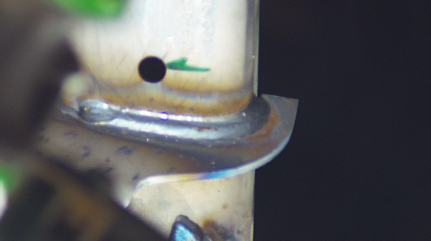
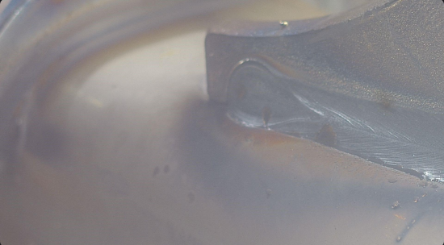

# FAQ

This page lists a series of questions that have been asked on the Discord channel and whose answers may be useful to everyone.

=======================================================================

**Question 1** :

On some images, we can see multiples welding seams that can be detected, my first question is : do we expect to take it into account for the produced result ?

**Answer 1** :

Each image is supposed to have only one welding that is considered. In some cases, a second welding is visible on the background or in a peripherical position. In this case,  the considered welding is the main one on the foreground that is the most visible.

======================================================================

**Question 2** :
What is the purpose of the blur_class column in the metadata? According to the description, this column is derived from blur_level ("clean" if blur_level > 950 else "blur"). Are images whose blur_level is under 950 are considered OOD? What is the purpose of the luminosity_level column?

**Answer 2** :

The columns blur_level, blur_class, luminiosity_level are only optionnal informations that are not connected to the definition of the ODD.
(you could use your own method to estimate the level of blur or luminosity) 

The ODD bound for blur perturbation is defined as  -> The human eye cannot  visually see welding state on the image because it's too blurred

For luminosity, it is the same kind of criterion--> ODD bound are defined as when  The human eye cannot  visually see the welding anymore, because the image is too dark or too bright

======================================================================

**Question 3** :

Are OOD scores interpreted only as binary responses (0 or 1)? i.e. For OOD score, is there any difference if I output a score of 0 or 0.5? or 1 and 1.5 ?

**Answer 3** :

The OOD evaluation methodology is based on the roc_auc_score metric so there may be a difference between a 0 and a 0.5 or 1 and 1.5 (it's also mean that the convention of values >1 = OOD score is not really used in the evaluation process).
 
However, the OOD evaluation set is selected or generated to be unambiguous for humans—for example, using clear, high-visibility images as IOD data and severely low-visibility samples as OOD. Details of the metrics are provided in the site's evaluation tab: https://confianceai.github.io/Welding-Quality-Detection-Challenge/docs/evaluation/ .

======================================================================

**Question 4** :

Are the following images considered inD  (in domain) or OOD (out of domain) ? 

*example 1*



*example 2*



**Answer 4** :

 For example 1,  even if there is an obstacle, the welding area is still visible. Thus , it shall be considered as inD

 For example 2,  It is more difficult to say. this is an ambiguous  case.  Because of the lack of luminosity we are near the frontier between, inD and OOD. We could consider it OOD but near the frontier inD/OOD probably with an ood score slightly greater than 1 

 =========================================================================

 **Question 5**

 If I detect that a given welding on an image is invisible and belongs ODD (odd_score >= 1), is it still necessary to provide predictions and probability distribution of classes for that welding? Or can I just fill them up with random values (to save inference time).

 **Answer 5**

 To ensure consistency, of outputs, and prevent bugs with the evaluation pipeline, the AI component shall always return a predicted label and a probability vector . This is  the outputs named "predictions" and "probabilities" of the predict method of your AI component.  (even if these informations may be not used during some evaluations parts in these OOD cases)
 Ideally, If the input image is detected as OOD (out of domain) thus with an OOD score >1, the AI component shall return   UNKNOWN as predicted label, with a probability=1 . In practical  
 ``` {"predictions": "UNKNOWN", "probabilities":[0,0,1]} ``` 
 
 You can hard code this output in this case to save inference time 

 ==========================================================================

  **Question 6**

  The competition description states: "Inference time must not exceed 1/12 of a second for each image." Does it mean that this limit is applied individually for every single image during inference or is it context of average time per image (so inference for some images can exceed 1 / 12 seconds but the overall average is still less 1 / 12 seconds)?

  **Answer 6**

Theoretically, the inference time constraint applies individually to each images. 

 In practical in the pipeline, for the evaluation, to  take into account  to some random behavior about inference time that would be caused by our hardware and not by your AI component we consider the time corresponding to the quantile value of 0.95. 