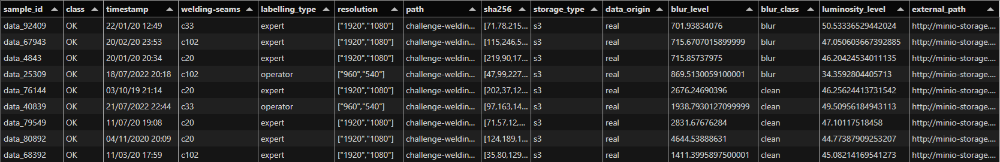

## Datasets description

In this section,  a sample is "a single image" of welding.

A dataset accessible in this challenge is described with a parquet file containing the metadescription of all samples contained within this dataset.
A parquet file is a format representing a dataframe. For each sample the following fields are available :

 **Field**             | **Description** |
|----------------------|----------------|
|sample_id|Unique identifier for the sample. It follows the template "data_X" |
|class|Real state of the welding present on the image, this is the ground_truth. Two values are possible OK or KO|
|timestamp |Datetime where the photo has been taken, this field shall not be useful  |
|welding-seams | Name of the welding seams to which the welding belongs. The welding-seams are named "c_X"|
|labelling_type | Type of person that annotated the data. two possible values: "expert" or "operator"|
|resolution | List containing the resolution of the image [width, height]|
|path | Internal path of the image in the challenge storage|
|sha256 | It's a unique hexadecimal key representing the image data. This is used to detect alteration or corruption on the storage.|
|storage_type |Type of sample storage: "s3" or "filesystem" |
|data-origin | Type of data. This field has two possible values (real or synthetic). In the proposed datasets, there are only real samples|
|blur_level | Level of blur in the image. This measure has been made numerically using opencv library. The lesser this value, the blurrier the image becomes.|
|blur_class | Class of blur deduced from blur-level field. Two class are considered "blur" and "clean".  The value is set to "blur" when blur level is inferior to 950.|
|lumninosity_level | Percentage of luminosity in the image, measured numerically.|
|external_path | Url of the image. This url shall be used by Challengers to directly download the sample from the dataset from storage|

## Dataset examples

### Example_mini_dataset 
A reduced sample of the dataset "example_mini_dataset" is provided to a give an overview of the final dataset provided for this challenge.
This sample contains 2857 images of welding split into 3 different welding-seams (c102,c20,C33).
The metadata file of this dataset can be found here: [example_mini_dataset metadata](https://minio-storage.apps.confianceai-public.irtsysx.fr/challenge-welding/datasets/example_mini_dataset/metadata/ds_meta.parquet)

This an example of the first 9 rows of this metadescription file

The dataset can be downloaded directly as a zip file: [Download example_mini_dataset](https://minio-storage.apps.confianceai-public.irtsysx.fr/challenge-welding/datasets/example_mini_dataset.zip)]

### Welding-detection-challenge-dataset

The complete dataset provided with this challenge is named “welding-detection-challenge-dataset”. It contains 22753 images of welding covering three different welding-seams named c20, c102 and c33.
The metadata file of this dataset can be found here: [welding-detection-challenge-dataset](https://minio-storage.apps.confianceai-public.irtsysx.fr/challenge-welding/datasets/welding-detection-challenge-dataset/metadata/ds_meta.parquet)
Please note that the complete dataset is the one you need for this challenge.

The whole dataset can be downloaded directly as a zip file : [Download welding-detection-challenge-dataset](https://minio-storage.apps.confianceai-public.irtsysx.fr/challenge-welding/datasets/welding-detection-challenge-dataset.zip)]