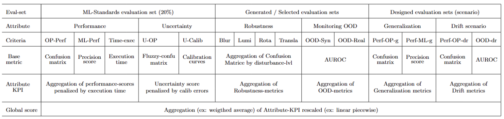
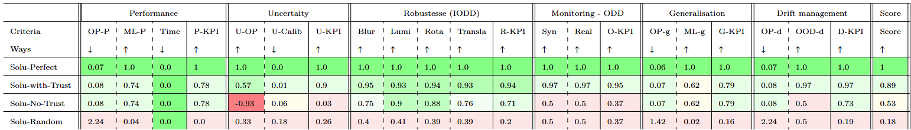
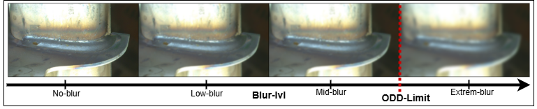
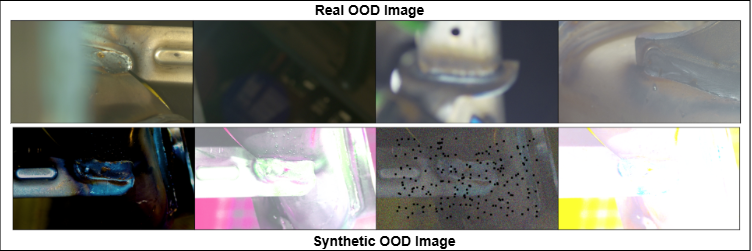
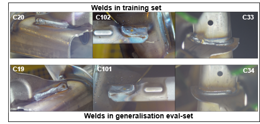
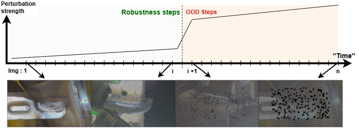

# ML-Trustworthy Evaluation Protocol

## Multi-Criteria Aggregation Methodology

The ML-Trustworthy evaluation of the submitted AI component follows a **multi-criteria aggregation methodology** designed to ensure a fair and reliable assessment of various **trust attributes**.  
The table below illustrates the principle of metrics aggregation:

## Example of a comparative results table for four fictional submissions.

The following table illustrates a performance overview of four different virtual solutions which were actually evaluated (using manually constructed inference files) using the trustworthy AI pipeline. The indicator color codes are for illustrative purposes only.

Among these four submissions:
 - **Solu-Perfect**: The ideal solution, achieving perfect scores in both performance and all trust-related attributes.
- **Solu-No-Trust**: A realistic solution without any dedicated mechanisms to address trustworthy AI concerns.
- **Solu-With-Trust**: The same base solution as Solu-No-Trust, but enhanced with mechanisms for handling uncertainty, robustness, OOD monitoring, and drift management.
- **Solu-Random**: A baseline solution that returns random predictions.

We observe that the **Solu-Perfect** solution achieves a perfect score across all metrics. Both **Solu-No-Trust** and **Solu-With-Trust** show identical scores in terms of Performance and Generalization. However, Solu-With-Trust significantly improves its trustworthiness scores across other attributes such as Uncertainty, Robustness, Monitoring, and Drift Management.

## ML-Trustworthy Evaluation design

The evaluation protocol was designed to assess both **performance** and **trustworthiness requirements**, based on the **Operational Design Domain (ODD)** derived from operational needs linked to the AI component's automated function (i.e., assistance in weld validation).

After identifying the relevant **trust attributes** (e.g., *robustness*) associated with specific **trust properties** (e.g., *output invariance under blur perturbation*), the evaluation methodology was structured into the following stages:

- **Evaluation Specification**  
  What specific model behaviors do we want to assess and validate?

- **Evaluation Set Specification**  
  What kind of data must be used or constructed to test whether the model exhibits the expected behavior under specific conditions?

- **Evaluation Set Design**  
  What data should be selected or generated to build these evaluation sets?

- **Evaluation Set Validation**  
  How can we ensure that the evaluation datasets are reliable and representative of the scenarios being analyzed?

- **Criteria Specification**  
  What criteria should be defined to measure the presence or absence of the expected behavior?

- **Metrics Design**  
  What metrics can be used to quantify these criteria?

- **Trust-KPI Design**  
  How can these criteria be aggregated into a **Trust-KPI** for each trust attribute?

## Steps of the Metrics and Trust-KPI Computation

The aggregation process consists in several key steps:

In this section, $\alpha_{i}$ $\beta_{i}$ and $k_{i}$ are weigthing or scaling coeficients used for the multicriterions aggregation.

### 1. Computation of Metrics Related to Trust Attributes

- Several metrics are computed for each attribute using specific evaluation datasets, in order to capture different aspects of the attribute’s performance.
- These evaluation datasets are either selected or synthetically generated to test distinct behavioral criteria.

### 2. Normalization of Attribute Metrics

- All attribute-specific metrics are normalized to a score within the range \[0, 1\], where **1** represents the best possible performance.
- Normalization is performed using appropriate transformations (e.g., sigmoid functions, exponential decay), depending on the nature of each metric.

### 3. Trust-KPI Aggregation

- For each attribute denoted X, a specific aggregation function combines the k-th normalized X metrics into a single **trust-KPI** denoted $I_X$.
- This allows for a comprehensive representation of the model’s performance with respect to each trust attribute.

$$ I_X = agg(X_{metric_1},..,X_{metric_k})$$

For example, if X is the attribute "performance":  $X_{metric_1}=OP$, $X_{metric_2}=ML$, and $X_{metric_3}=Time$

### 4.Piecewise Linear Rescaling of Trust-KPIs

  - To ensure consistency and comparability across attributes, each KPI undergoes a **piecewise linear rescaling**.
  - This rescaling takes into account both predefined performance and confidence requirements.
  - This rescaling accounts for predefined performance and confidence thresholds, aligning the raw scores with evaluation constraints.

$$f'(x) =
\begin{cases}
\frac{\beta_1}{\alpha_1} f(x), & 0 \leq f(x) < \alpha_1 \\
\frac{\beta_2 - \beta_1}{\alpha_2 - \alpha_1} (f(x) - \alpha_1) + \beta_1, & \alpha_1 \leq f(x) \leq \alpha_2 \\[8pt]
\frac{1 - \beta_2}{1 - \alpha_2} (f(x) - \alpha_2) + \beta_2, & \alpha_2 < f(x) \leq 1
\end{cases}$$

### 5. Weighted Aggregation of Trust-KPIs
  - The rescaled attribute KPIs are then aggregated into a **final evaluation score** using a **weighted mean**.
  - Each weight reflects the relative importance of its corresponding attribute within the overall trustworthy AI assessment.
$$ score= \alpha_1*I_{perf} + \alpha_2*I_{U} + \alpha_3*I_{rob} + \alpha_4*I_{ood} + \alpha_5*I_{gen}+\alpha_6*I_{drift}$$

with :
- $\alpha_1$ =0.3,  $\alpha_2$ =0.15,  $\alpha_3$ =0.25  $\alpha_4$ =0.2,   $\alpha_5$ =0.05,  $\alpha_6$ =0.05, 
### 6. Purpose of the Aggregation Protocol

The goal of this aggregation process is to produce a single, comprehensive trust score that captures the system’s performance across six key trust attributes. Each of these attributes is assessed through multiple criteria, measured with relevant metrics and normalized to reflect their practical impact.

## Trust-KPI and metrics by attribute.

### Performance attribute

**Purpose**: Measures the model's predictive accuracy and efficiency, ensuring it meets baseline expectations in a controlled environment.

**Evaluation sets**: Standard ML evaluation set based on a representative 20% split of the dataset.

**Metrics**:
  - **OP-Perf** (Operational Performance): Evaluates model performance through an operational view using confusion-matrix-based metrics that account for the cost of different error types and weld criticality.

       $$OP = \sum_{k}^{|N|} \sum_{i}^{true_{class}} \sum_{j}^{pred_{class}} \mathbb{1}_{Top_{class}(\hat{y}_k)=j} * cost(i,j,k,k_{seam}) $$

  where N is the number of sample in the evaluation datasset and $k_{seams}$ is the name of the welding-seam

  - $k_{c_{102}}= 0.2$
  - $k_{c_{20}}= 0.4$
  - $k_{c_{33}}= 0.4$

 Here is below the considererd cost matrix used to penalize the different situations.

  |                | Predicted KO | Predicted OK |Predicted UNKNOWN|
  |----------------|----------------|----------------|-----------|
  | **True KO**    | 26.4           | 3000           | 41        |
  | **True OK**    | 30             | 0.4            | 20        |

  As it was mentionned in the description of the usecase, a False negative is highly penalized.

  - **ML-Perf** (Machine Learning Performance): Assesses performance using standard ML metrics such as precision.
    $$ ML = \frac{\sum_{i=1}^{N} \mathbb{1} (y_i = 1 \land \hat{y}_i = 1)}{\sum_{i=1}^{N} \mathbb{1} (\hat{y}_i = 1)}$$

where $y_i$ is the ground truth and $\hat{y}_i$ is the AI component prediction

  - **Inference Time (Times)**: Measures computational efficiency and runtime.

**Performance-KPI**: Combines OP-Perf and ML-Perf using a weighted average, penalized by inference time to reflect operational constraints.
$$ I_{perf}=\frac{(\alpha_{op} e^{-k_c OP} + \alpha_{ml} ML)}{1 + k_t ln(1+t)} $$

where :
- $t$ is the 95-th quantile of set of inference time on evaluation dataset
- $k_c=1$
- $k_t=12$
- $\alpha_{op}=0.4$
- $\alpha_{ml}=0.6$

### Uncertainty assessement
**Purpose** : Evaluates the AI component’s ability to express meaningful and calibrated uncertainty, helping assess the risk of decision errors.

**Evaluation sets**: Standard ML evaluation set based on a representative 20% split of the dataset.

**Metrics**:
  - **U-OP** (Uncertainty Operational Gain): Relative measures of the virtual gain (in operational term) to consider probabilistic outputs compared to hard outputs predictions in relation to the gap between the perfect solution and the current hard outputs predictions.
  $$c^{U} = \sum_{k}^{|N|} \sum_{i}^{true_{class}} \sum_{j}^{pred_{class}} \hat{y}_k(j) * cost(i,j,k,k_{seam}) $$

  $$ UOP = \frac{(c^{U} - c^{op})}{(c^{op} - c^{op}_{perfect})}$$

  - **U-Calib** (Calibration Quality): Evaluates how well predicted probabilities align with actual error rates (e.g., Expected Calibration Error).
    $$ UCalib = \sum_{m=1}^{M} \frac{|B_m|}{N} acc(B_m) - conf(B_m)$$

    This indicator is separately computed for both OK samples subset and KO sample subset to take into account the unbalanced property of the dataset. The used ponderation weights are $UCalib_{OK}=0.2$ and $UCalib_{KO}=0.8$.

**Uncertainty-KPI** : Combines Uncertainty Operational Gain with calibration error.

$$I_{U} = UOP * (1 - 2*(UCalib_{KO}*0.2+UCalib_{OK}*0.8))$$

### Robustness
**Purpose**: Assesses model stability under perturbations such as blur, lighting variation, rotation, and translation.
In alignment with the defined ODD, we evaluate whether the model remains robust when facing variations in blur, luminance, rotation, and translation.This evaluation uses synthetically generated images, as long as the perturbations stay within the specified ODD boundaries. 

**Evaluation sets**: Generated by applying synthetic perturbations to a weld-balanced subset of the standard evaluation set.
Those perturbations are generated to cover the operational domain (ODD)

- For rotation  , we apply different level of rotation between -30° and 30°
- For translation , we apply different translation vectors of type (x,x) for x varying between 0 and 20 pixels. We use the same upper bound 20 px for ODD limit regardless the image resolution.( [1920*1080] or [960*540])

- For blur, we apply increasing blur intensities. The bound limit is defined visually. We stop when the welding become
not visible on the image

- For luminosity, we apply increasing and decreasing luminosity intensity. The bound limits are defined visually. We stop 
when the image is too dark, or to bright to see the welding on it .

**Metrics**:
   - **Blur Robustness** : Aggregation (AUC) of the ML-performance (Precision score) across increasing perturbation levels .
   - **Luminance Robustness** : Aggregation (AUC) of the ML-performance (Precision score) across increasing perturbation levels.
   - **Rotation Robustness** : Aggregation (AUC) of the ML-performance (Precision score) across increasing perturbation levels.
   - **Translation Robustness**: Aggregation (AUC) of the ML-performance (Precision score) across increasing perturbation levels.

$$ r^x = Auc(ML_{\delta_1}/,..., ML_{\delta_k}) $$ 

where $x\in \{blur,lum,rot,trans\}$ and $\delta_k$ are the different perturbation levels

**Robustness-KPI** : Weighted aggregation of robustness scores across all perturbation types.

$$ I_{rob} = \sum_{i \in {blur,lum,rot,trans}} \alpha_{r_i} * r^i $$ 

$\alpha_{blur}=0.3$ , $\alpha_{lum}=0.3$ , $\alpha_{rot}=0.2$, $\alpha_{trans}=0.2$
### OOD-Monitoring 

**Purpose**: Evaluates the model's ability to detect and handle out-of-distribution (OOD) inputs.
We rely on the broad and informal criterion:
“Is the weld sufficiently visible?”. So the model is expected to detect in a unsupervised framework, when the image conditions do not allow for a reliable prediction.

**Evaluation sets**: Includes both synthetic and real OOD datasets with a balanced mix of normal and OOD samples. 

- The Real-world OOD Dataset is built through manual inspection of available images, including samples that are: Excessively blurry, Captured under extreme lighting conditions, or Contain visual obstructions that prevent clear weld visibility.

- The Synthetic OOD Dataset created by applying strong perturbations, such as: Blur, Abnormal luminance, Severe color artifacts, Gaussian noise combined with dead pixels (Few images are provided in the Evaluation tab).

Here is below some example of image from both datasets

**Metrics**
  - **Real-OOD score** : AUROC on the real OOD evaluation set denoted $OOD_{real}$.
  - **Syn-OOD score** :AUROC on the synthetic OOD evaluation set $OOD_{syn}$.
  

**OOD-Monitoring KPI**: Weighted average of real and synthetic OOD detection performance.
$$I_{ood} = \alpha_{syn}*OOD_{syn} + \alpha_{real}*OOD_{real}$$

with : 

$\alpha_{syn}=0.3$, $\alpha_{real} =0.7$

### Generalization 
**Purpose**: Measures the model’s ability to generalize to unseen weld types that share characteristics with the training set.

**Evaluation sets**: Built using data from weld types excluded during training but with similar visual/structural traits.

**Metrics**:
  - **OP-Perf-g** Operational performance on the generalization set.
  - **ML-Perf-g** ML performance (e.g., precision) on the generalization set.

**Generalization-KPI**: Aggregated from OP-Perf-g and ML-Perf-g.
$$I_{gen} = \alpha_{op}*e^{-k_{op}*OP_g} + \alpha_{ml}*ML_{g}$$

with $k_{op}=0.05$

Subindice $g$ in $ML_g$ or $OP_g$ means that metrics are computed on the generalization dataset.

The  values for $\alpha$ are the same as those used for the computation of operational score.

### Data-Drift handling
**Purpose**: Evaluates both the robustness and OOD detection of the model in response to gradual data drift.

**Evaluation sets**: Constructed by applying increasing levels of synthetic perturbations to a normal data sequence, simulating drift. Final segments are manually labeled as OOD.

**Metrics**:
  - Perf-OP-d : Operational performance under drift.
  - OOD-d: "OOD-Detection score" : AUROC on the drift-induced OOD subset.  

**Data-Drift-KPI**: Combines performance and detection ability during simulated drift.
$$I_{drift} = \alpha_{OP_{d}} * e^{-k_{op} * OP_{d}} + \alpha_{OOD_{d}}*OOD_{d}$$

where subindice $d$ means that the metrics are computed only on the drifted dataset

The coefficient values are : 

$k_{op}$=0.05, $\alpha_{OP_{d}}=0.5$, $\alpha_{OOD_{d}}=0.5$
# Last scoring update

Since June 13th 1 p.m , several minor changes have been made to the evaluation pipeline, incorporating feedback from the warm-up challenge.
These adjustments aim to improve the fairness, relevance, and readability of the metrics produced by the evaluation process.
The ranking logic was validated using both virtual reference solutions (e.g., with 1% error) and naive solutions (e.g., always predicting "OK") to ensure consistency in the scoring system.
 
Minor changes:
- The FBeta score (β = 1) is now used as the main performance and robustness metric.
- Some metric formulas were slightly adjusted to ensure that: a perfect solution receives the maximum score on each attribute while a worst-case solutions (varying by KPI-attribute) receive the minimum score.
- Metric scaling coefficients and aggregation weights were refined based on performance observed with virtual reference solutions.
- A linear piecewise rescaling was applied to KPI attributes, so that: poor solution (e.g., "Full UNKNOWN") scores around 10 while a good solution (e.g., ~3% error) scores around 90 for most KPI attributes.
- The drift evaluation set was slightly extended to reduce the dominance of KO cases, which had introduced bias into the scoring.
 
Example – Reference Solution Performance Table:
 
As an example, we include below the performance table of reference virtual solutions used to validate the logical consistency of the ranking :
 
Virtual reference solutions:
- Perfect: No classification or OOD detection errors → Score: 100
- Very Good: 0.5% to 1% classification error and 1% OOD detection error → Score: ~95–99
- Good: 2.5% to 5% classification error and 5% OOD detection error → Score: ~90
 
Naive solutions:
- Full UNKNOWN: Always predicts "unknown" → Score: ~10
- Full Random: Random predictions → Very low score
- Full KO: Always predicts "KO" → Very low score
- Full OK: Always predicts "OK" → Very low score
